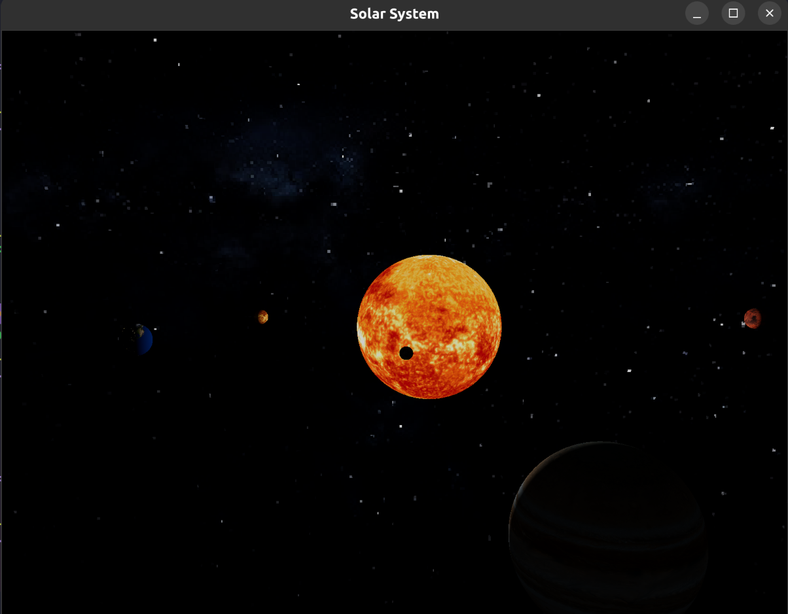
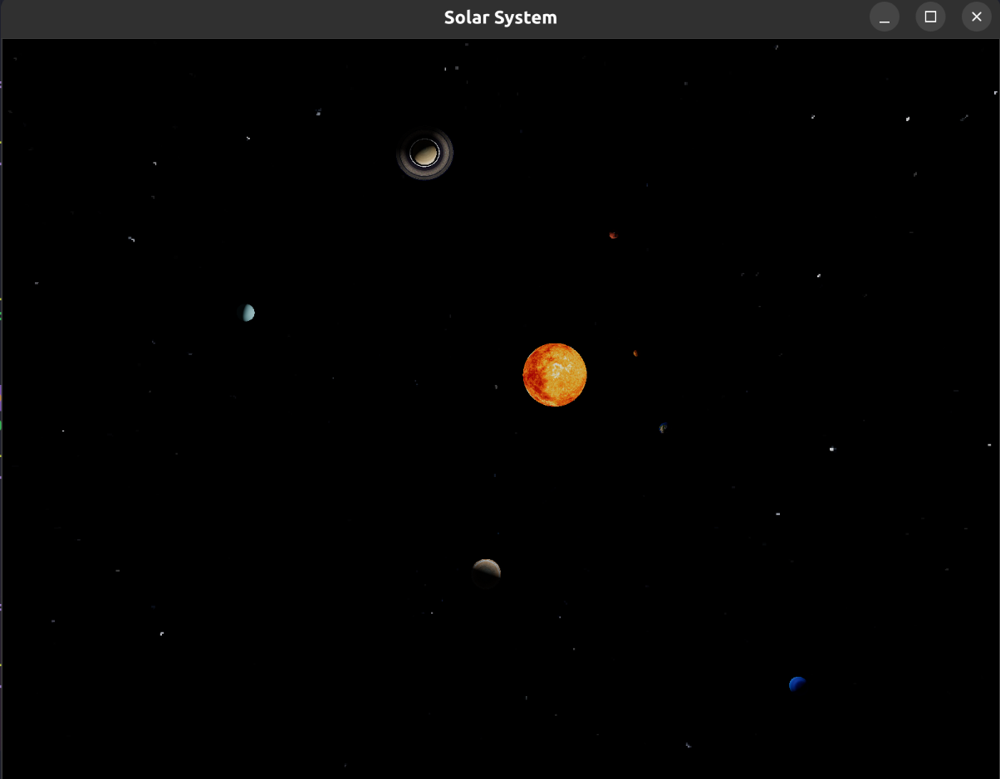
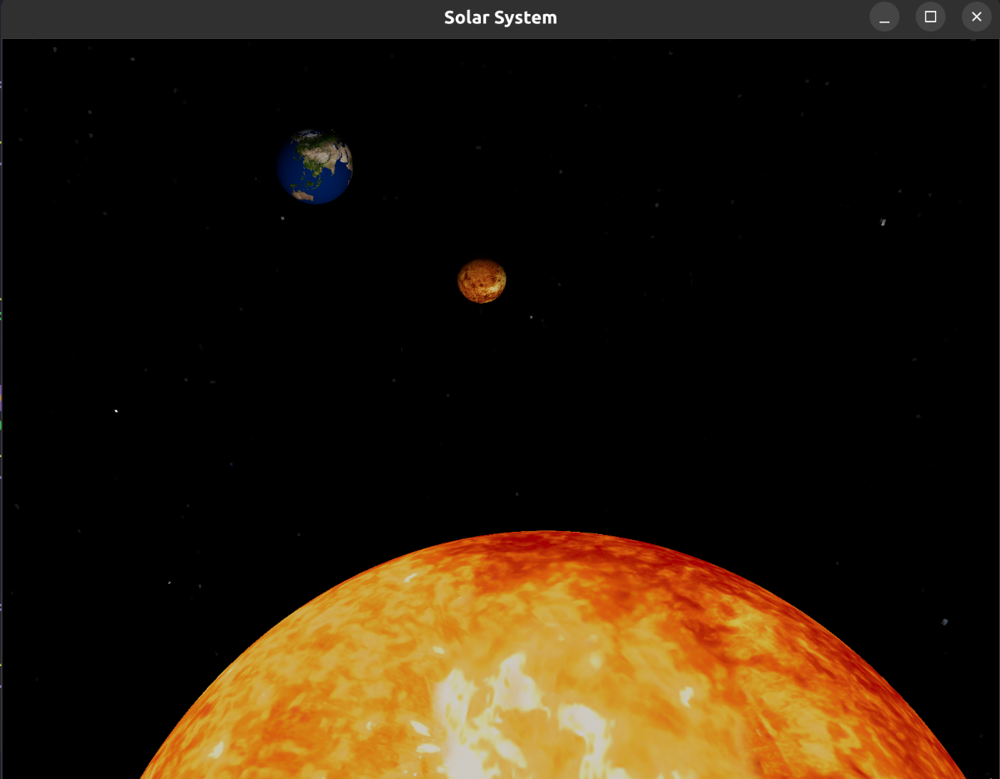
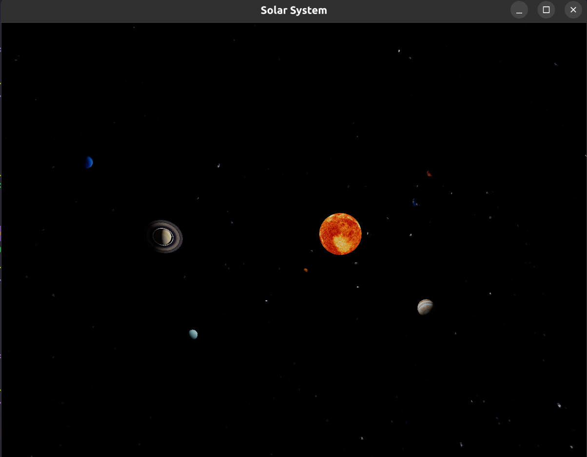
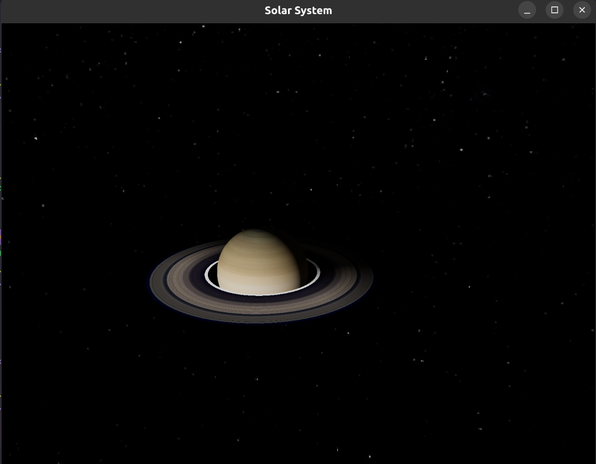
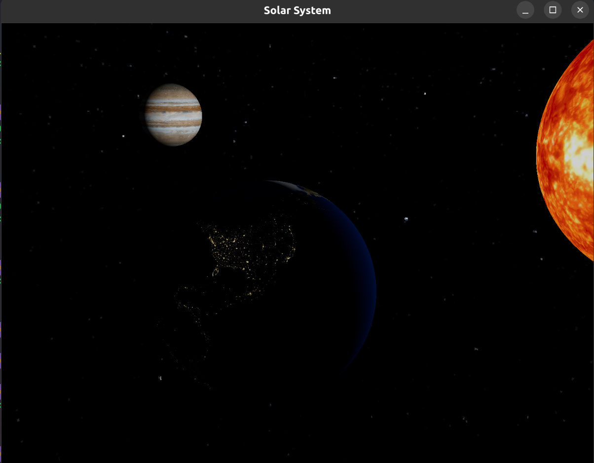
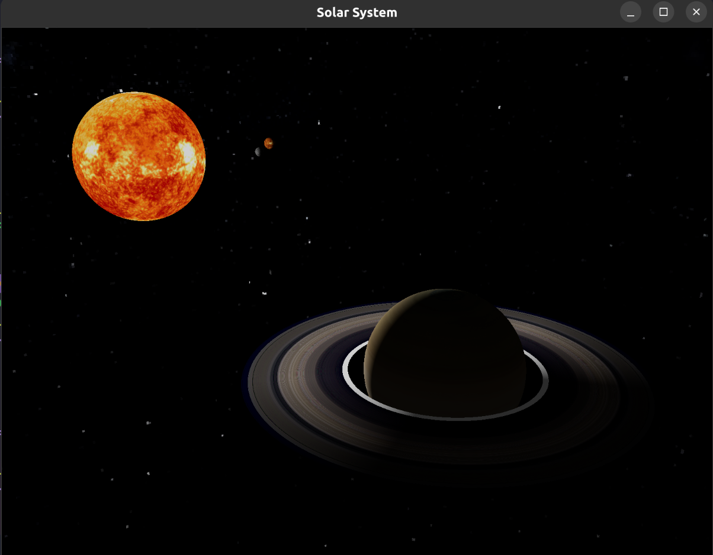

# Solar System

Simple solar system visualization built using WebGPU.

## Features

- Procedural sphere and ring mesh generation (planets and Saturn’s rings)
- Instanced rendering
- High Dynamic Range (HDR) rendering and tonemapping
- Skybox
- Animated planetary orbits and rotations
- Uses a single texture array to store all planet textures
- Saturn’s ring has a dynamic “fake shadow” effect, instead of real shadow mapping, a shader darkens the part of the ring furthest from the sun.
- Earth uses a dedicated night-side texture, when the planet is facing away from the sun, a special night map is displayed instead of relying only on lighting.

## Controls & Key Bindings

- *W / S / A / D or Arrow Keys*: Move the camera forward, backward, left, and right
- *Space / Left Shift*: Move the camera up and down
- *Mouse*: Look around (when cursor is locked)
- *L*: Lock/unlock the mouse cursor for free look
- *T / B / G*: Instantly move the camera to top, bottom, or side preset views
- *Escape*: Exit the application

## Demo

Here are screenshots from the application:

### All objects

### Saturn and its ring

### Night effects

